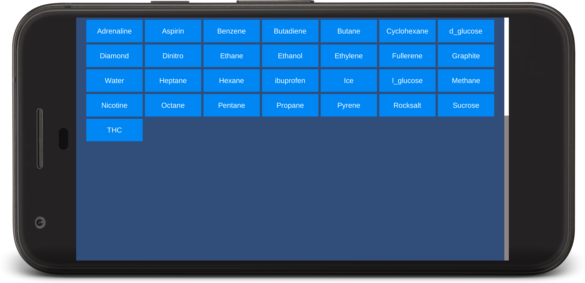
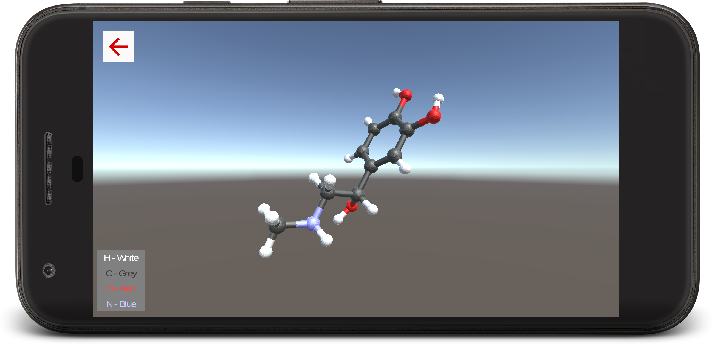
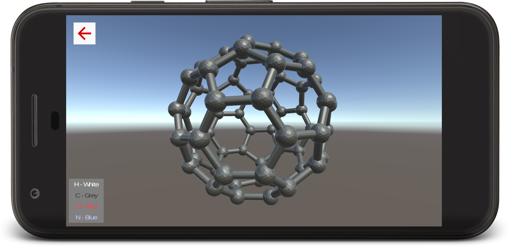
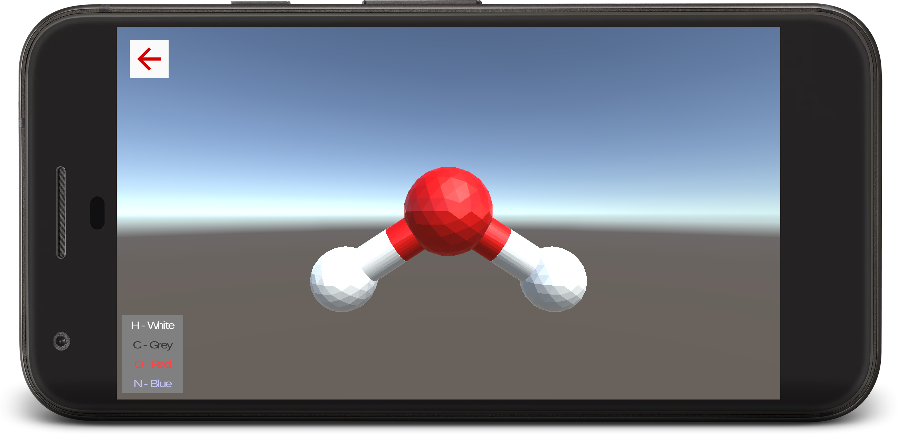

# MolView
#### [Download](https://github.com/electron0zero/MolView/releases) for Windows, Android, Linux & WebGL

A simple Unity3D application with bunch of interactive molecules

Can be used to teach the structure of molecules in classrooms

Apps for Android, Windows and linux is in release tab, download and play around

Assets (3D files) used in this project is available at [MolView--3d-data-files](https://github.com/electron0zero/MolView--3d-data-files)

# Screenshots

### Mobile

### Desktop

## License
Copyright [2017] [Suraj Nath]

Licensed under the Apache License, Version 2.0 (the "License");
you may not use this file except in compliance with the License.
You may obtain a copy of the License at

    http://www.apache.org/licenses/LICENSE-2.0

Unless required by applicable law or agreed to in writing, software
distributed under the License is distributed on an "AS IS" BASIS,
WITHOUT WARRANTIES OR CONDITIONS OF ANY KIND, either express or implied.
See the License for the specific language governing permissions and
limitations under the License.